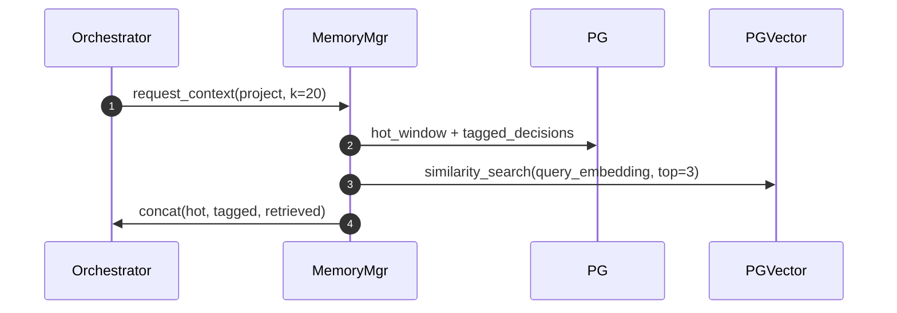

# V7 Orchestrator – Detailed Design (v1)

This document translates the high-level concept laid out in [fsm_orchestrator/concept.md](fsm_orchestrator/concept.md) into a concrete, build-ready plan.  
It explains why each architectural choice was made and how the major pieces fit together.

---

## 1  Goals & Non-Goals

|                         | In scope (v1) | Out of scope (deferred) |
|-------------------------|--------------|-------------------------|
| ≤ 5 concurrent game projects | ✅ | large-scale SaaS hosting |
| ≤ 50 active agents            | ✅ | multi-tenant isolation   |
| 1 h latency budget per state-handoff | ✅ | sub-minute real-time chat |
| Art / design / code / infra workflows | ✅ | Marketing, finance agents |
| Web dashboard with OAuth        | ✅ | E-mail approval workflow (v2) |

---

## 2  Architecture Overview

```
┌───────────┐   Web UI / CLI   ┌──────────────────┐
│ Operator  │◄────────────────►│ Approval Service │ (FastAPI)
└───────────┘                  └──────────────────┘
        ▲ events / overrides
        │
        ▼
┌─────────────────────────────────────────────────────────┐
│                Orchestrator Core (Python)              │
│ ┌─────────────┐ ┌────────────┐ ┌─────────────────────┐ │
│ │ Hier-FSM    │ │ Arbiter    │ │ Memory Mgr (RDB+Vec)│ │
│ └─────────────┘ └────────────┘ └─────────────────────┘ │
│        │               │                 │             │
│        ▼               ▼                 ▼             │
│  Agent Runtime   Telemetry/Cost     PostgreSQL 15      │
│  (LLM + tools)      Monitor       (jsonb + pgvector)   │
└─────────────────────────────────────────────────────────┘
```

### 2.1  Key Decisions

* **Python 3.13**: fastest path to shipping; rich AI/ML, async, and DevOps libraries.  
  *Trade-off*: slower raw throughput vs Go/Rust; acceptable inside 1 h budget.

* **Hierarchical FSM** instead of flat 1:1 agent-to-state mapping: avoids “state explosion” as new personas are added.

* **PostgreSQL + `jsonb` + `pgvector`**: keeps all structured data, chat logs, and embeddings in one cloud-portable engine.  
  *Alternative*: Redis + Pinecone → rejected (extra infra, vendor lock-in).

* **OpenTelemetry → Prometheus/Loki**: de-facto OSS stack, cloud-agnostic, minimal cost at our scale.

* **Google OAuth proxy**: lowest-friction auth for a small, trusted team.

---

## 3  Core Algorithms

| # | Name | Purpose | Notes |
|---|------|---------|-------|
| 1 | **Hier-FSM Transition** | Move between nested states while preserving parent context. | Implemented as DAG; guarantees acyclic progress. |
| 2 | **Transition Arbiter** | Resolve competing agent proposals via weighted score (urgency 0.3 / dependency 0.4 / user_intent 0.3). | Inspired by Gemini CLI’s priority queue. |
| 3 | **Memory Compression** | Reduce prompt size while retaining semantics; sliding window → embedding summary. | Stores both full log (90 d) and compressed vector. |
| 4 | **Deadlock Detector** | Identify ≥ K identical transitions → escalate to human. | Protects against infinite loops. |
| 5 | **Cost Budget Enforcer** | Throttle or reroute tasks if token spend exceeds project budget. | Ensures predictable OpEx. |
| 6 | **Memory Retrieval-Augmented Generation (MRAG)** | Retrieve high-salience chunks + embedding summaries before every LLM call. | Reduces hallucination and context loss; guarantees that “decision tags” make it into the prompt. |
| 7 | **Cost-Aware Fair Scheduler** | Queue `<task, project_id, est_tokens, priority>`; apply weighted round-robin with token-budget back-pressure. | Prevents project starvation, keeps cluster within budget envelope. |

### 3.1  Enhanced Memory Management 💾
1. **Dual-Layer Store**  
   • **Hot window** (≈ 20 messages) in RAM → sent verbatim to the LLM.  
   • **Warm layer** (semantic summary) stored in `compressed_memory`.  
   • **Cold layer** (full log older than 90 d) archived to S3-compatible object store.

2. **Important-Decision Tagging**  
   Agents add `@DECISION(reason=…, impact=…)` markers. These snippets bypass compression and are always surfaced by MRAG.

3. **Retrieval Flow**


### 3.2  Agent Scheduling ⚙️
1. **Task Queue:** `tasks(id, project_id, agent_id, payload, eta, priority, est_tokens)`. Stored in Postgres; polled via LISTEN/NOTIFY or Redis Streams if throughput demands.

2. **Scheduler Service (new micro-service)**
```python
def schedule():
    for task in fetch_ready_tasks(order_by="priority, created_at"):
        if will_exceed_budget(task):  # cost_monitor check
            postpone(task)
        else:
            dispatch_to_agent(task)
```
   • **Weighted round-robin** across projects to guarantee fairness.  
   • **Back-pressure** when project’s weekly token cap is 80 %+ consumed.  
   • Retries with exponential back-off; poison-queue after N failures.

3. **Module Additions**
```text
fsm_orchestrator/
└─ scheduler/
   ├─ queue.py          # enqueue / dequeue helpers
   ├─ scheduler.py      # main loop
   └─ workers.py        # agent execution wrappers
```

4. **Observability**  
   Metric `scheduler_lag_seconds{project_id}` and `tokens_consumed_total{agent}` exported via OTLP → Prometheus; alert at P95 > 300 s.

---

## 4  Module Layout

```
fsm_orchestrator/
├─ core/
│  ├─ orchestrator.py      # event loop
│  ├─ fsm.py               # hierarchical state engine
│  ├─ arbiter.py           # transition arbitration logic
│  ├─ memory.py            # compression / retrieval
│  ├─ cost_monitor.py      # token & $ accounting
│  ├─ deadlock.py          # loop detection
│  └─ models.py            # Pydantic domain models
├─ agents/
│  ├─ base.py              # common agent interface
│  ├─ art_concept.py
│  ├─ designer.py
│  ├─ engineer.py
│  └─ infra.py
├─ api/
│  ├─ web.py               # FastAPI + OAuth dashboard
│  └─ schemas.py
└─ persistence/
   ├─ db.py                # SQLAlchemy session
   └─ migrations/          # Alembic scripts
```

---

## 5  Data Model (PostgreSQL 15)

| Table | Key Columns | Rationale |
|-------|-------------|-----------|
| `projects` | `id`, `name`, `status` | Single row per game project. |
| `agents` | `id`, `persona`, `model_name`, `active` | Track LLM instances & roles. |
| `state_transitions` | FK → `projects`, `from_state`, `to_state`, `confidence`, cost columns | Auditable decision trail. |
| `messages` | FK → `projects`, `agent_id`, `role`, `content`, `token_count` | Full chat history (90 d). |
| `compressed_memory` | FK → `projects`, `embedding`, `summary` | Vector store for long-term memory. |

Retention: `messages` and `state_transitions` archived after 90 days; summaries kept indefinitely.

---

## 6  Workflow Walk-Through

1. **Prompt kick-off**: Operator pushes new branch to GitHub → webhook triggers `CreateProject` event.  
2. **Ideation loop**: `ArtConceptAgent` spawns, produces concept → proposes transition to `DesignerState`. `DesignerAgent` critiques, may hand back. Arbiter chooses best path at each step.  
3. **Code phase**: `EngineerAgent` opens PR; human review required in GitHub UI (production changes are always human-gated).  
4. **Infra phase**: `InfraAgent` writes Terraform, plan output sent to dashboard; human hits “Apply” → GitHub Actions deploy to target cloud.  
5. **Completion**: Project marked `released`; cost report auto-emailed.

---

## 7  Deployment Pipeline

| Stage | Tooling | Cloud-specific? |
|-------|---------|-----------------|
| Build  | GitHub Actions Docker build | No |
| Test   | PyTest + Playwright (dashboard) | No |
| Package| Helm chart | No |
| Deploy | Any K8s (GKE/EKS/AKS/k3s) | Portable |
| Secrets| HashiCorp Vault | OSS, self-hosted |

---

## 8  Open Items

* JSON schema for `TransitionProposal`.  
* Load-test script: 5 projects × 50 agents × 10 loops.  
* UI wireframes for dashboard.  
* Benchmark pgvector vs Redis-vector at small scale.

---

_Authored 26 Jul 2025 – aligns with items in [`todo.md`](../../todo.md)._  
_This document supersedes the rough sketch in `concept.md` and will